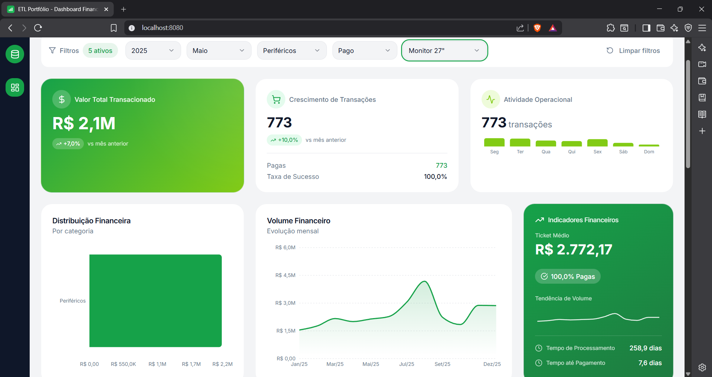
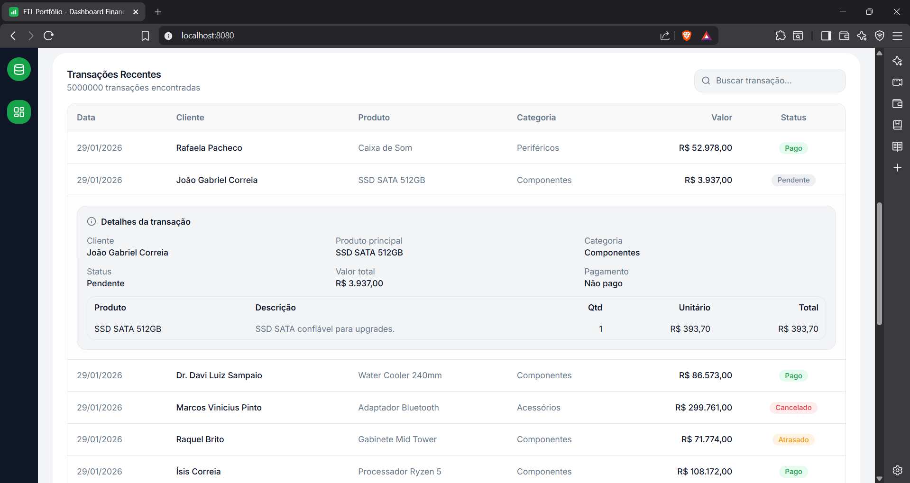
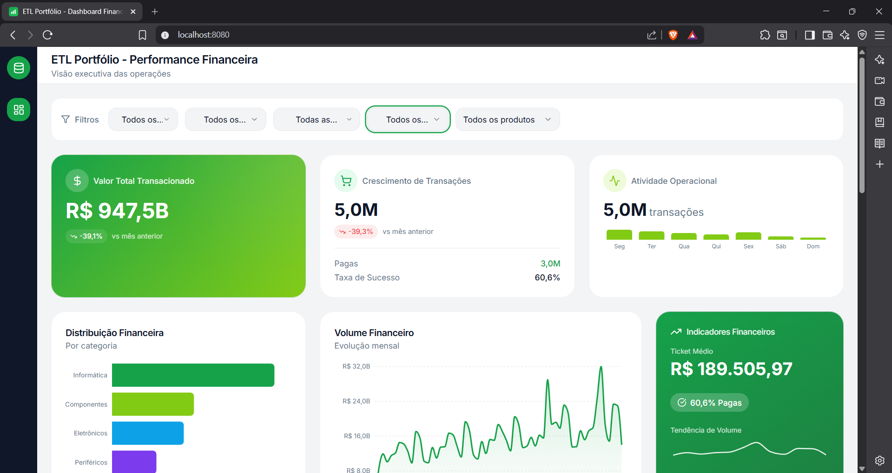

# ETL Portfólio + Dashboard Financeiro

Projeto de portfólio integrado: ETL (Python) + PostgreSQL + API FastAPI + Dashboard (React).  
Foco em volume, consistência de dados, métricas comparativas e performance.

## O que este projeto demonstra

- Pipeline ETL completo: extração, transformação, validação e carga em lote.
- Modelagem mais realista: catálogo de produtos + itens por transação.
- Carga acelerada com COPY nativo do PostgreSQL (opcional e configurável).
- API com filtros e comparativos (mês/ano anterior).
- Dashboard interativo com cross-filtering e detalhamento de transações.
- Views prontas para Power BI.

## Capturas do dashboard







## Pré-requisitos

- Python 3.12+
- PostgreSQL 15+ (testado em 18.1)
- Node.js 18+
- Power BI Desktop (opcional)

## Setup rápido

1) Banco de dados
```bash
psql -d etl_portfolio -f sql/setup.sql
psql -d etl_portfolio -f sql/optimizations.sql
```

2) ETL (setup + amostra)
```bash
cp .env.example .env
pip install -r requirements.txt
python scripts/main.py --generate-sample
python scripts/main.py
```

3) Geração de dados realistas (portfólio)
```bash
python scripts/generate_portfolio_data.py --rows 5000000 --years 5
python scripts/main.py
```
Gera catálogo, transações e itens com sazonalidade, variação semanal e nomes em pt-BR.

4) API (FastAPI)
```bash
uvicorn api.main:app --reload --port 8000
```
Ao subir, a API gera `dashboard/public/mock.json` como snapshot para fallback.

5) Dashboard
```bash
cd dashboard
npm install
npm run dev
```

## Script de start/stop (dev)

Para subir e derrubar API + dashboard rapidamente:

```powershell
.\scripts\dev_services.ps1 -Action start
.\scripts\dev_services.ps1 -Action stop
```

Outras opções:
```powershell
.\scripts\dev_services.ps1 -Action status
.\scripts\dev_services.ps1 -Action restart
```

Para mudar portas:
```powershell
.\scripts\dev_services.ps1 -Action start -ApiPort 8001 -DashPort 3000
```

Se o PowerShell bloquear execução:
```powershell
Set-ExecutionPolicy -Scope Process -ExecutionPolicy Bypass
```

## Variáveis de ambiente

### ETL/API (`.env`)
- `DB_HOST`, `DB_PORT`, `DB_NAME`, `DB_USER`, `DB_PASSWORD`
- `ETL_USE_COPY` (true/false) – usa COPY para grandes volumes
- `ETL_COPY_THRESHOLD` (ex: 200000) – mínimo de linhas para usar COPY
- `API_CORS_ORIGINS` (opcional)
- `API_SNAPSHOT_LIMIT` (opcional)

### Dashboard (`dashboard/.env`)
```
VITE_API_URL=http://localhost:8000
VITE_USE_MOCK=false
```
Se `VITE_USE_MOCK=true`, o dashboard usa o snapshot/gerador local.

## Documentação

- ETL detalhado: [README_ETL.md](README_ETL.md)
- Dashboard: [dashboard/README.md](dashboard/README.md)
- Performance: [docs/performance_report.md](docs/performance_report.md)
- Power BI: [docs/powerbi_connection_guide.md](docs/powerbi_connection_guide.md)
- PRD do projeto: [ETL.md](ETL.md)
